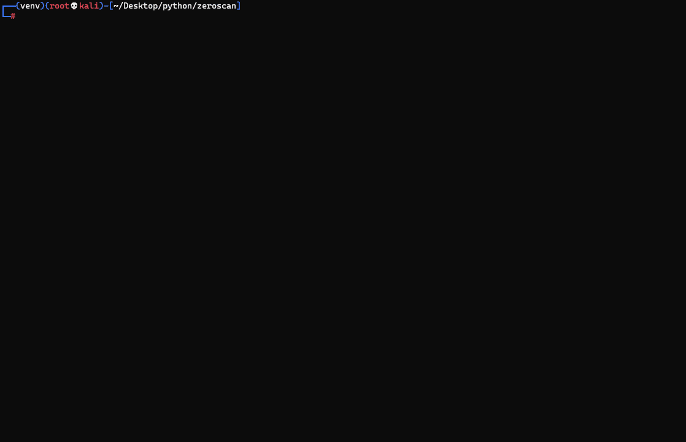

# zeroscan

Zeroscan is a Domain Controller vulnerability scanner, that currently includes checks for Zerologon (CVE-2020-1472), MS-PAR/MS-RPRN and SMBv2 Signing.

<br>

**CVE-2020-1472:**

Uses a built-in script to check for Zerologon (CVE-2020-1472), but does NOT attempt to exploit the target, it is simply a vulnerability scanner. 
Codebase borrowed from: https://github.com/SecuraBV/CVE-2020-1472 

<br>

**MS-PAR / MS-RPRN:**

Uses a wrapper around Impacket's rpcdump to check if the print services MS-PAR and MS-RPRN are remotely accessible. This check may help to determine if the target is vulnerable to CVE-2021-1675.

<br>

**SMBv2 Signing:**

Uses a wrapper around the Nmap Scripting Engine (NSE) script 'smb2-security-mode', to identify the target's SMBv2 signing configuration.

<br>


<br>

**Installation:**


    git clone https://github.com/NickSanzotta/zeroscan.git
    cd zeroscan/
    virtualenv -p /usr/bin/python3.9 venv
    source venv/bin/activate
    python3 -m pip install -r requirements.txt

**Menu:**
```
Zeroscan
--------------------------------------------------

Usage:
  python3 zeroscan.py -t dc01 192.168.1.10
  python3 zeroscan.py -iL /path/to/targetfile.txt
  python3 zeroscan.py -iL /path/to/targetfile.txt --database
  python3 zeroscan.py -iL /path/to/targetfile.txt --drop-table
  python3 zeroscan.py -iL /path/to/targetfile.txt -r
  python3 zeroscan.py -iL /path/to/targetfile.txt -v


Primary options:
  -t TARGET TARGET     Single target using netbiosname and ipaddress. I.e "dc01 192.168.1.10"
  -iL TARGETSFILE      File that contains one target per line using netbiosname and ipaddress. I.e "dc01 192.168.1.10"

Secondary options:
  --database DATABASE  Filepath for database file.
  --drop-table         Drops database table.
  -r, --rpc-message    Turn on RPC response messages for CVE-2020-1472, helpful when troubleshooting connectivity issues.
  -v, --verbose        Turn on verbosity, helpful when debugging code.
  -h, --help           Show this help message and exit.
```

**Sample Output:**
```
╔════════════════════════════════════════════════════════ ZEROSCAN ═════════════════════════════════════════════════════════╗
╚═══════════════════════════════════════════════════════════════════════════════════════════════════════════════════════════╝
Impacket v0.9.23

./zeroscan.py -iL targets.txt
CVE-2020-1472
DC01 192.168.160.134  - AUTH-ATTEMPTS: 26
DC02 192.168.160.133  - AUTH-ATTEMPTS: 1
DC03 192.168.160.137  - AUTH-ATTEMPTS: 2000


Impacket v0.9.23

rpcdump.py @ipaddress
MS-PAR/MS-RPRN
DC01 192.168.160.134 - MS-PAR: False, MS-RPRN: False
DC02 192.168.160.133 - MS-PAR: False, MS-RPRN: False
DC03 192.168.160.137 - MS-PAR: True, MS-RPRN: True


Nmap 7.91

nmap -Pn --script smb2-security-mode -p 445 -iL ./outputfiles/targets.txt -oX ./outputfiles/xml/smb2-security-mode.xml
SMB2-SECURITY-MODE
192.168.160.134 - MESSAGE SIGNING ENABLED BUT NOT REQUIRED
192.168.160.137 - MESSAGE SIGNING ENABLED AND REQUIRED


                                              Zeroscan Database
╔══════════╤═════════════════╤════════════════╤════════╤═════════╤══════════════════════════════════════════╗
║ Hostname │ IP Address      │ CVE_2020_1472  │ MS_PAR │ MS_RPRN │ SMBv2_Signing                            ║
╟──────────┼─────────────────┼────────────────┼────────┼─────────┼──────────────────────────────────────────╢
║ DC01     │ 192.168.160.134 │ VULNERABLE     │ False  │ False   │ Message signing enabled but not required ║
║ DC02     │ 192.168.160.133 │ NA             │ False  │ False   │ NA                                       ║
║ DC03     │ 192.168.160.137 │ NOT VULNERABLE │ True   │ True    │ Message signing enabled and required     ║
╚══════════╧═════════════════╧════════════════╧════════╧═════════╧══════════════════════════════════════════╝
```

**Demo - Multi-target:**


