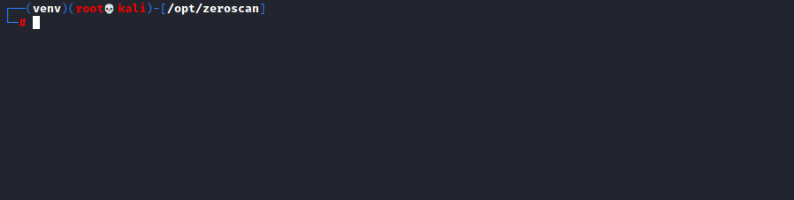
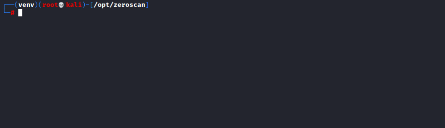
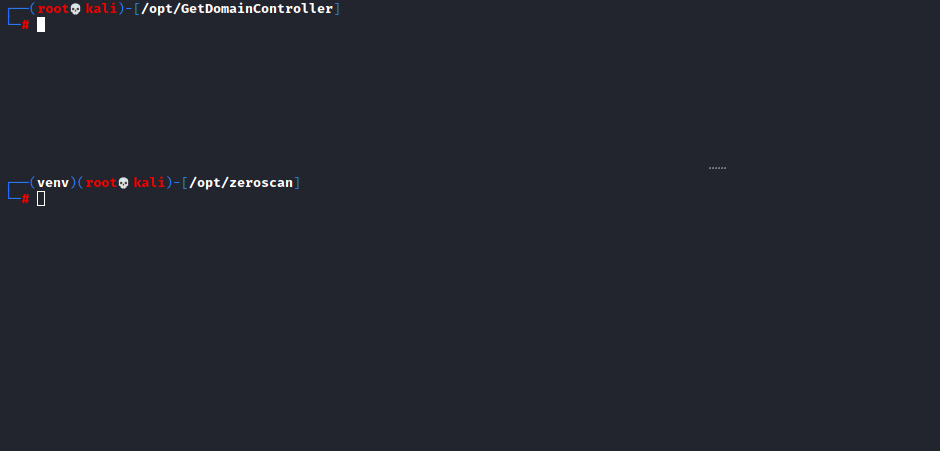

# zeroscan

Zeroscan is a vulnerability scanner for CVE-2020-1472 aka Zerologon that supports a single target or a list of targets.
This script does not attempt to exploit the target, it is simply a vulnerability scanner.
Codebase borrowed from: https://github.com/SecuraBV/CVE-2020-1472 


<br>


<br>

**Installation:**


    git clone https://github.com/NickSanzotta/zeroscan.git
    cd zeroscan/
    virtualenv -p /usr/bin/python3.9 venv
    source venv/bin/activate
    python3 -m pip install -r requirements.txt

**Menu:**
```
Zeroscan
--------------------------------------------------

Usage:
  python3 zeroscan.py -t dc01 192.168.1.10
  python3 zeroscan.py -iL /path/to/targetfile.txt
  python3 zeroscan.py -iL /path/to/targetfile.txt -r
  python3 zeroscan.py -iL /path/to/targetfile.txt -v


Primary options:
  -t TARGET TARGET   Single target using netbiosname and ipaddress. I.e "dc01 192.168.1.10"
  -iL TARGETSFILE    File that contains one target per line using netbiosname and ipaddress. I.e "DC01 192.168.1.10"

Secondary options:
  -r, --rpc-message  Turn on RPC response messages, helpful when troubleshooting.
  -v, --verbose      Turn on verbosity, helpful when debugging.
  -h, --help         Show this help message and exit
```

**Single Target:**



**Target File:**



**View RPC Reponses:**


**Zeroscan + GetDomainController:**
<br>
For a more automated approach use Zeroscan along with GetDomainController 'https://github.com/NickSanzotta/GetDomainController'

